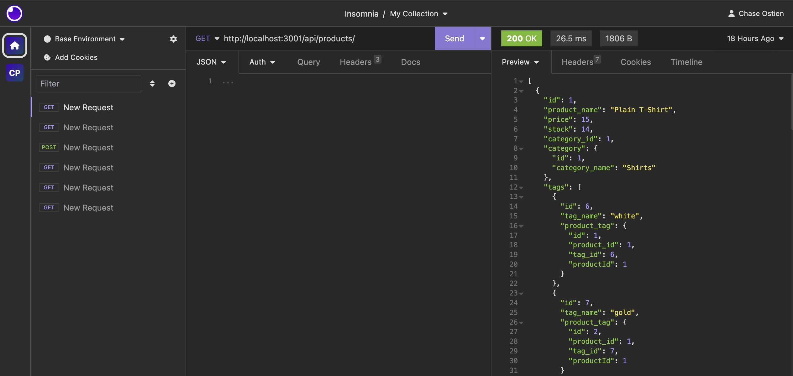

# E-Commerce Back End 

## Table of Contents
* [Description](#description)
* [Installation](#installation)
* [Usage](#usage)
* [License](#license)
* [Contributors](#contributors)
* [Tests](#tests)
* [Questions](#questions)

## Description
This application will serve as a working backend for an E-Commerce site. We were given a working Express.js API and configure it to use Sequelize to interact with a MySql database. 
## Installation
To install this application, create a directory in which you will develop your application. Inititalize a `package.json` file by running `npm init -y`. You can then set up your git repo by running `git init` and creating a `.gitignore` file. You will include `node_modules` and `.DS_store` in your `.gitignore` to ensure they are not tracked or uploaded to GitHub. Ensure that your `package.json` file contains all of the required dependencies, including `sequelize": "^5.21.7`, `express: ^4.18.2`, `mysql2: ^3.6.0`, and `dotenv": "^8.2.0`. To store your MySQL user info in a `.env` file, you will need to create the file and list the user info you wish to keep privat inside. After checking your dependencies, install them by running `npm install` in your root directory. You should see your `node_modules` folder populate in your root directory. Ensure that you can successfully connect to your MySQL database by running a test db query in your JS file.
## Usage
To use this application, make sure you have followed all installation instructions and installed the required dependencies. Log into MySQL and run `SOURCE db/schema.sql` to create your database. To seed your database, navigate to your root directory and run `npm seed` in the terminal. To start the server and run this program, enter `npm start` in your terminal, this will start the program and sync the sequelize models with the MySql database. Once the server is live, you will be able to use an API tester such as Insomnia or Postman to test the Get, Post, Put and Delete routes for your API. 
#### Example of a test API call for this application in Insomnia.

#### Video recording of program flow and output. 
https://drive.google.com/file/d/1vemkUFW77781jlpwPpdvkHWi9fpUXBMh/view
## License
ISC License

https://opensource.org/licenses/ISC
## Contributors
This application utilizes started code provided by UT Full Stack Coding Bootcamp staff. The starter code sets up the server, config, schema and seeds. The models, routes and database connection were completed by myself, Chase Ostien.
## Tests
There are currently no written tests for this application, however, you can test its function by running the program and using an API tester to test the routes written in the routes directory.
## Credits
This README file was created using a command line README generator developed by myself and hosted at the GitHub repo below.

https://github.com/ChaseOstien/README_Generator

## Questions
### If you have any questions about this application, please send all correspondence to the contact info listed below. 
* GitHub: ChaseOstien - https://github.com/ChaseOstien
* Email: Chaseostien@gmail.com
